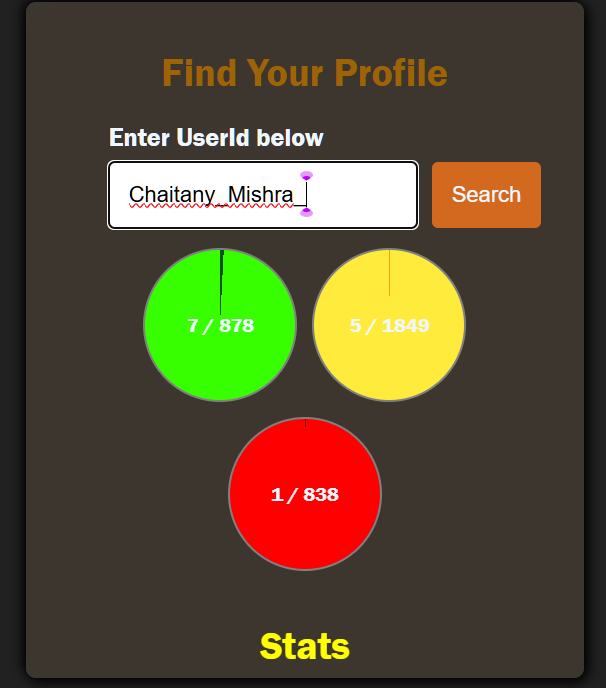

<<<<<<< HEAD
# 🚀 Mini Projects Showcase

Welcome to my **Mini Projects** repository! Here, I showcase all the small projects I’ve built during my learning journey in web development. These projects serve as practical demonstrations of various programming concepts and web development techniques using **HTML**, **CSS**, **JavaScript**, and other modern web technologies.

## 🔥 What’s Inside?

This repository features projects across multiple domains, ranging from basic utilities to more complex apps. Here’s a sneak peek into some of them:

---

### 📝 **To-Do List App**
- A **simple** yet **functional** To-Do application that allows users to add, remove, and mark tasks as completed.
- **Technologies Used:** HTML, CSS, JavaScript

### 🌦️ **Weather App**
- A sleek and **responsive** weather app that displays real-time weather information fetched from the **OpenWeather API**.
- **Features:**
  - Search by city.
  - View temperature, humidity, wind speed, and weather conditions.
- **Technologies Used:** HTML, CSS, JavaScript, OpenWeather API

### 🔍 **LeetCode Profile Finder**
- A **cool** tool that allows users to fetch and display their **LeetCode** profile statistics (like total solved problems, ranking, acceptance rate) by just entering a username.
- **Technologies Used:** HTML, CSS, JavaScript, Fetch API

### 🎮 **Mini Game (Coming Soon...)**
- A fun, interactive game designed to practice JavaScript logic and game mechanics.
- **Technologies Used:** HTML, CSS, JavaScript

### 💡 **Other Projects (More Coming Soon...)**
- The repository will continue to grow as I keep building new projects to showcase my learning.
- **Technologies:** React, Node.js, Express, MongoDB, and more...

---

## 🌱 How to Run the Projects Locally

Running these projects locally is easy! Just follow these simple steps:

1. Clone this repository to your local machine:

   ```bash
   git clone https://github.com/ChaitanyMishra/last365.git
💻 How to Contribute
I welcome contributions! Feel free to fork this repository, open issues, or submit pull requests with improvements or additional features. Let’s make this a growing collection of projects!

To contribute:

Fork the repository.

Clone your forked repository locally.

Create a new branch for your feature or bug fix.

Commit your changes and push them to your forked repository.

Submit a pull request with a description of the changes you made.

📜 License
This repository is open-source and available under the MIT License.
=======
# 🔍 LeetCode Profile Finder

A sleek, JavaScript-based web application that allows users to fetch and display LeetCode profile data by simply entering a username. Built to demonstrate DOM manipulation, API integration, and clean UI design.

---

## 🚀 Live Demo

👉 [Live Project on GitHub](https://github.com/ChaitanyMishra/last365/tree/main/LeetCode-Profile-Finder)

---

## 📸 Screenshot



---

## 🧠 Features

- ✅ Fetch LeetCode user profile using public GraphQL API
- 📊 Displays number of problems solved by difficulty (Easy, Medium, Hard)
- 🏆 Contest rating, rank, and global percentile shown
- 🔍 Real-time data fetch on username entry
- 💻 Fully responsive design for desktop and mobile
- 🎯 Built using only HTML, CSS, and JavaScript (No frameworks!)

---

## 🛠️ Tech Stack

| Technology   | Purpose                        |
|--------------|--------------------------------|
| HTML5        | Markup                         |
| CSS3         | Styling                        |
| JavaScript   | DOM manipulation, API logic    |
| LeetCode API | Profile data source            |

---


## 🧪 How to Use

1. **Clone the Repository:**

   ```bash
   git clone https://github.com/ChaitanyMishra/last365.git

🤝 Connect with Me
🔗 GitHub: ChaitanyMishra

💼 LinkedIn: https://www.linkedin.com/in/chaitany-dev-hash/

📧 Email: mr.chetan105@gmail.com


## 📁 Project Structure
>>>>>>> e13732b (Initial commit with README)

